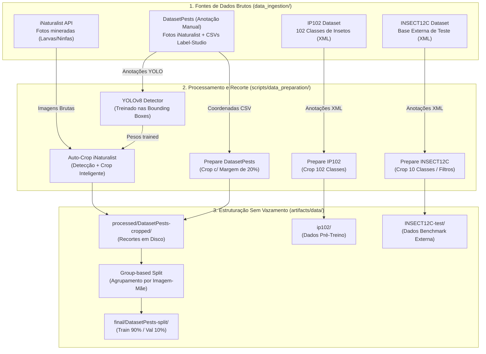

# 🛠️ Documentação do Pipeline de Pré-Processamento de Dados

Este documento descreve detalhadamente a arquitetura, as decisões metodológicas e o fluxo de dados da esteira de pré-processamento desenvolvida para a pesquisa de mestrado em **Detecção e Classificação de Danos por Pragas em Folhas de Soja**.

---

## 📐 1. Arquitetura Geral do Fluxo de Dados

O pipeline transforma dados brutos heterogêneos (fotos de campo, anotações em CSV do Label-Studio e dados minerados via API) em datasets padronizados, sem vazamento de dados (*data leakage*) e com preservação anatômica das pragas.



---

## 🧠 2. Fundamentação e Decisões Metodológicas

Cada etapa do pipeline responde a um desafio prático identificado durante o desenvolvimento da pesquisa de mestrado:

### A. Expansão de Margem (+20%) vs. Distorção de Aspect Ratio
* **Problema**: Recortes muito ajustados (*tight bounding boxes*) de pragas pequenas (ex: lagartas jovens ou ninfas), ao serem redimensionados diretamente para a resolução de entrada do modelo ($224 \times 224$ ou $240 \times 240$), sofriam deformações anatômicas severas e perda de textura foliar.
* **Solução**: Adição do parâmetro `--margin 0.20` no script `prepare_dataset_pests.py`. A caixa delimitadora é expandida em 20% ao redor da anotação, preservando o formato do inseto e incluindo a margem de contexto foliar (dano direto na folha).

### B. Agrupamento por Imagem-Mãe (*Group-based Stratified Split*)
* **Problema**: Uma única folha fotografada em campo pode conter múltiplos recortes de pragas ou ter sido submetida a aumentações de dados. Se um recorte de uma foto estivesse no conjunto de treino e outro recorte da mesma foto estivesse na validação, o modelo apresentaria métricas infladas por vazamento de dados (*data leakage*).
* **Solução**: O script `split_dataset_by_group.py` extrai o identificador único da foto original (imagem-mãe) e garante que 100% dos recortes oriundos daquela foto pertençam estritamente ao conjunto de **Treino** ou ao conjunto de **Validação**.

### C. Filtro de Fases de Vida (*Life Stage Filtering*)
* **Problema**: Espécies como *Anticarsia gemmatalis* e *Spodoptera albula* possuem fases adultas (mariposas) que não atacam as folhas diretamente, enquanto a fase larval (lagarta) é a verdadeira responsável pelo dano desfolhador.
* **Solução**: Mineração no iNaturalist (`download_inaturalist.py`) filtrando os atributos de fase de vida (`term_id=1`, `term_value_id=6` para Larva/Lagarta).

### D. Transferência de Aprendizado de Domínio (*Domain-Specific Pre-training*)
* **Problema**: Pesos padrão do ImageNet foram treinados em objetos genéricos (carros, cachorros, utensílios).
* **Solução**: O IP102 contém 102 classes e milhares de imagens de insetos agrícolas. Treinar a backbone primeiro no IP102 pré-condiciona os filtros convolucionais para padrões taxonômicos de insetos antes do *fine-tuning* nas pragas de soja.

---

## 📋 3. Descrição Detalhada dos Módulos

### 1️⃣ Detecção YOLOv8 & Mineração iNaturalist
* **Scripts**: `scripts/yolo_inaturalist/create_yolo_dataset.py`, `train_yolo.py`, `auto_crop_inaturalist.py`
* **Função**: Converte as anotações manuais do DatasetPests para o formato YOLO, treina um detector `YOLOv8n` de classe única (`pest`) e utiliza esse modelo para localizar e recortar autonomamente as pragas das fotos mineradas da API do iNaturalist.
* **Saída**: Recortes com o prefixo `inat_` salvos em `artifacts/data/processed/DatasetPests-cropped/`.

### 2️⃣ Recorte do DatasetPests (Anotação Manual)
* **Script**: `scripts/data_preparation/prepare_dataset_pests.py`
* **Parâmetros**: `--margin 0.20` (expansão de 20%).
* **Função**: Lê as coordenadas relativas dos CSVs exportados do Label-Studio e gera os cultivos dos insetos originais.
* **Saída**: `artifacts/data/processed/DatasetPests-cropped/<classe>/`.

### 3️⃣ Divisão Sem Vazamento
* **Script**: `scripts/data_preparation/split_dataset_by_group.py`
* **Parâmetros**: `--only-teachers` (opcional: desconsidera recortes `inat_` para isolar os dados anotados manualmente no laboratório).
* **Função**: Agrupa por imagem-mãe e divide em 90% Treino e 10% Validação de forma estratificada.
* **Saída**: `artifacts/data/final/DatasetPests-split/train` e `val`.

### 4️⃣ Preparação do IP102 (Pré-Treinamento de Domínio)
* **Script**: `scripts/data_preparation/prepare_ip102.py`
* **Função**: Faz o parsing das anotações Pascal VOC (XML) do dataset IP102 e recorta os insetos das 102 classes.
* **Saída**: `artifacts/data/ip102/train` e `val`.

### 5️⃣ Preparação do INSECT12C (Benchmark Externa)
* **Script**: `scripts/data_preparation/prepare_insect12c.py`
* **Função**: Prepara a base externa de teste INSECT12C mapeando de 12 para 10 classes compatíveis com a taxonomia do projeto.
* **Saída**: `artifacts/data/final/INSECT12C-test/`.

---

## ⚡ 4. Guia de Execução Rápida

Todo o fluxo documentado acima foi consolidado em um script bash automatizado e executável:

```bash
# Execução padrão (margem 20%, dataset misto)
bash scripts/run_preprocessing_pipeline.sh

# Execução apenas com o dataset de anotação manual (margem 20%)
bash scripts/run_preprocessing_pipeline.sh 0.20 true
```
