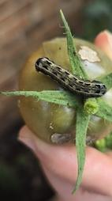
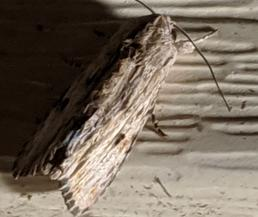
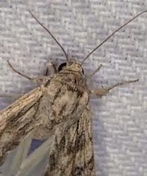
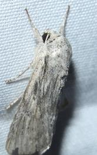
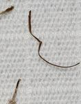

# 🔍 Análise Qualitativa de Ruído Amostral, Polimorfismo e Falsos Positivos da Mineração

Este documento formaliza o diagnóstico qualitativo dos recortes (*crops*) gerados pelo pipeline de mineração automatizada via API do iNaturalist e localização pelo detector YOLOv8. Serve como registro técnico e fundamentação empírica para a compreensão dos modos de falha e da discrepância de generalização observada no benchmark externo (*INSECT12C*).

---

## 🔬 1. Contexto e Motivação da Mineração Automatizada

Para contornar o desbalanceamento severo de classes em pragas desfolhadoras e sugadoras na cultura da soja, desenvolveu-se uma esteira automatizada composta por:
1. Ingestão de observações via API do iNaturalist com filtros taxonômicos e de fase de vida (`term_id=1`, `term_value_id=6` para Larva);
2. Detecção e recorte autônomo de caixas delimitadoras via modelo `YOLOv8n` treinado na classe genérica `pest`.

Embora a esteira tenha viabilizado o aumento do volume de dados para 11.468 recortes no total, a auditoria visual pós-treinamento revelou fontes críticas de variabilidade intra-classe que explicam a discrepância de desempenho entre a validação interna (*DatasetPests*) e a avaliação de robustez externa (*INSECT12C*).

---

## 📸 2. Diagnóstico Empírico das Amostras Auditadas (*Spodoptera albula*)

A inspeção detalhada da classe `spodoptera_albula` (localizada em `artifacts/data/processed/DatasetPests-cropped/spodoptera_albula/`) identificou três perfis morfológicos distintos presentes no dataset de treino:

### A. Amostra Canônica Ideal (Fase Larval em Tecido Vegetal)

* **Arquivo:** [`inat_obs_244363539_crop_1.jpg`](images/inat_obs_244363539_crop_1.jpg)
* **Descrição Visual:** Lagarta íntegra com padrão listrado longitudinal nítido, cápsula cefálica preservada, em postura ativa de alimentação sobre tecido vegetal.
* **Impacto no Modelo:** Fornece os gradientes convolucionais desejados para reconhecimento de danos de desfolha no campo.

### B. Polimorfismo de Fase de Vida (Espécimes Adultos / Mariposas)

  
  
  

* **Arquivos Auditados:**
  * [`inat_obs_42444465_crop_0.jpg`](images/inat_obs_42444465_crop_0.jpg) (Mariposa em repouso com asas dobradas sobre superfície plana);
  * [`inat_obs_244826083_crop_0.jpg`](images/inat_obs_244826083_crop_0.jpg) (Mariposa adulta com vista dorsal e asas triangulares sobre pano de amostragem);
  * [`inat_obs_247051453_crop_0.jpg`](images/inat_obs_247051453_crop_0.jpg) (Mariposa adulta cinzenta de grande porte em pano de captura noturna).
* **Causa-Raiz:** No iNaturalist (plataforma colaborativa de ciência cidadã), metadados de ciclo de vida frequentemente são marcados a nível de observação geral por voluntários. Usuários que monitoram o ciclo da praga anexam fotos do adulto emergido, ou marcam erradamente a fase larval em observações de espécimes adultos.
* **Impacto no Modelo:** A classe passa a ter uma **distribuição bimodal no espaço latente** (corpos cilíndricos/vermiformes vs. corpos triangulares/alados com escamas), forçando o extrator de características a gastar parâmetros com padrões irrelevantes para o dano foliar direto.

### C. Falsos Positivos de Detecção (Fragmentos Anatômicos e Artefatos)

* **Arquivo:** [`inat_obs_247158339_crop_4.jpg`](images/inat_obs_247158339_crop_4.jpg)
* **Descrição Visual:** Antena / apêndice isolado sobre tecido branco, sem corpo ou morfologia discernível de lagarta.
* **Causa-Raiz:** O detector YOLOv8n, calibrado para sensibilidade alta em caixas de pequeno porte, ocasionalmente detecta segmentos corporais ou detritos como pragas individuais (`pest`).
* **Impacto no Modelo:** Ruído puro de fundo que atua como regularizador indesejado ou vetor de confusão em classes com poucas amostras.

---

## 📊 3. Correlação Científica com as Métricas Experimentais

A identificação desse ruído explica com exatidão dois fenômenos observados no benchmark:

1. **Divergência entre Validação Interna e Teste Zero-Shot:**
   * **Validação (*DatasetPests*):** F1-score de *S. albula* alcançou **0.902 a 0.963** entre os modelos pré-treinados no IP102 e ImageNet. Como a partição de validação foi extraída da mesma base minerada, o conjunto de validação continha amostras semelhantes de mariposas e lagartas.
   * **Teste Zero-Shot (*INSECT12C*):** F1-score caiu para a faixa de **0.672 a 0.778**. O INSECT12C é composto **estritamente por lagartas fotografadas em lavouras reais**. O modelo treinado em mariposas e lagartas perdeu densidade discriminativa específica para lagartas puras.
2. **Resiliência de Arquiteturas Mais Profundas:**
   * Modelos com maior capacidade de canal e blocos com atenção convolucional (como `EfficientNetV2-B1`, F1=0.778 no INSECT12C) lidaram substancialmente melhor com a variabilidade multimodal do que redes ultraleves como `MobileNetV3-Small` (F1=0.481 no INSECT12C).

---

## 📌 4. Conclusões Técnicas e Recomendações

### Síntese do Diagnóstico de Erros
* **Causa do Gap de Generalização:** A divergência de desempenho observada em *Spodoptera albula* entre a validação interna (*DatasetPests*) e o teste externo (*INSECT12C*) decorre prioritariamente da presença de espécimes em fase adulta (mariposas) e de falsos positivos do detector (apêndices e detritos) na base minerada via ciência cidadã.
* **Impacto no Espaço Latente:** A coexistência de lagartas e mariposas forçou a rede a aprender uma distribuição bimodal para uma única classe, dispersando a densidade discriminativa e reduzindo a precisão em dados de campo compostos unicamente por lagartas.
* **Resiliência Arquitetural:** Redes com maior capacidade de canal e blocos com atenção convolucional (e.g., EfficientNetV2-B1) absorveram significativamente melhor o ruído bimodal em comparação com redes ultraleves.

### Recomendações Técnicas para Trabalhos Futuros
* **Classificação Hierárquica:** Adoção de uma etapa prévia de predição do estágio biológico (*Fase: Larva vs. Adulto* ➔ *Espécie*), eliminando espécimes adultos antes da inferência específica de desfolha.
* **Calibração e Filtragem do Detector YOLO:** Elevação do limiar de confiança (*confidence threshold*) e filtragem por área mínima para evitar que apêndices e fragmentos anatômicos isolados sejam classificados como pragas ativas.

---

## 📚 5. Referências Bibliográficas

* **JOCHER, G.; CHAURASIA, A.; QIU, J.** *Ultralytics YOLOv8*. Versão 8.0.0, 2023. Disponível em: <https://github.com/ultralytics/ultralytics>.
* **UNGER, S. et al.** *iNaturalist as a tool for citizen science and biodiversity monitoring: quality, biases and potential*. Biological Conservation, v. 257, p. 109099, 2021.
* **WU, X. et al.** *IP102: A Large-Scale Benchmark Dataset for Insect Pest Recognition*. In: **IEEE/CVF Conference on Computer Vision and Pattern Recognition (CVPR)**, 2019, p. 8787-8796. DOI: [10.1109/CVPR.2019.00899](https://doi.org/10.1109/CVPR.2019.00899).

