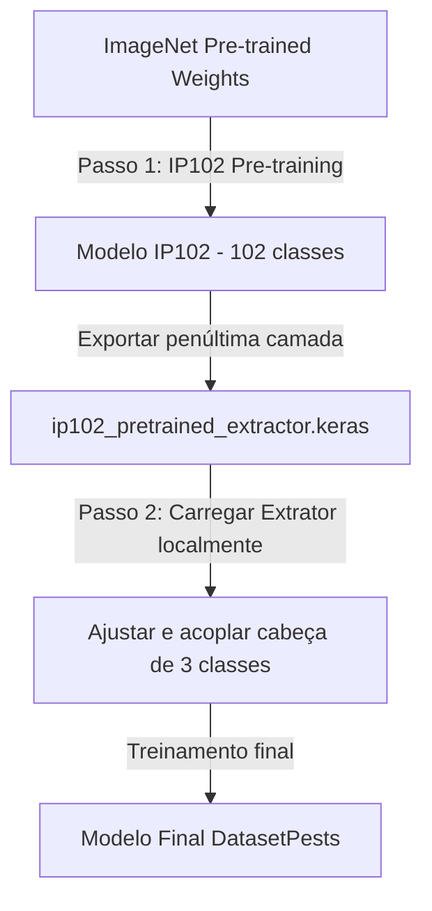

# Guia de Implementação e Verificação: Treino Intermediário (IP102) & Fine-Tuning

> [!NOTE] REGISTRO HISTÓRICO (FASE PRELIMINAR - 3 CLASSES)
> Este documento é mantido como registro do planejamento inicial de refatoração do extrator IP102 quando o projeto ainda abordava 3 classes (Caterpillars, Diabrotica, Healthy).
> O projeto evoluiu para o catálogo oficial de **10 espécies de pragas** documentado em [`docs/01_ROTEIRO_TECNICO_E_METODOLOGICO.md`](../../docs/01_ROTEIRO_TECNICO_E_METODOLOGICO.md).

Este guia documenta o processo completo de refatoração do pipeline de visão computacional da `EfficientNetV2B1` para suportar o **Passo 1 (Domain-Specific Pre-training com IP102)** e o **Passo 2 (Fine-tuning no DatasetPests)**. 

---

## 1. Mapeamento Geral do Fluxo de Trabalho



---

## 2. Alterações de Código Efetuadas (Diffs e Arquivos Completos)

### 2.1 Adição de Experimentos no YAML
* **Arquivo:** [model_params.yaml](../../model_params.yaml)
* **Modificação:** Inserção das seções `ip102_pretrain` e `efficientnetv2b1_finetune` no início da chave `experiments:`.

```yaml
experiments:
  # ---------------------------------------------------------------------------
  # Passo 1: Domain-Specific Pre-training (IP102 - 102 classes)
  # ---------------------------------------------------------------------------
  ip102_pretrain:
    model:
      name: "EfficientNetV2B1"
      use_pretrained: true
      weights: "imagenet"
      use_compression_blocks: false
      use_se_block: false
      use_cbam: false
      use_sr_block: false
      dense_units: 128
    image:
      size: [240, 240, 3]
    training:
      batch_size: 64
      epochs: 50
      dropout_rate: 0.4
      use_cutmix: true
    optimizer:
      name: "sgd"
      learning_rate: 0.01  # peak lr para treino inicial
      momentum: 0.9
      nesterov: true
      initial_lr: 0.0001
      alpha: 0.001
    dataset:
      classes: 102
      train_ratio: 0.9
      val_ratio: 0.1
      test_ratio: 0.0

  # ---------------------------------------------------------------------------
  # Passo 2: Fine-Tuning Definitivo no DatasetPests
  # ---------------------------------------------------------------------------
  efficientnetv2b1_finetune:
    model:
      name: "EfficientNetV2B1"
      use_pretrained: true
      weights: "artifacts/models/ip102_pretrained_extractor.keras"
      use_compression_blocks: false
      use_se_block: false
      use_cbam: false
      use_sr_block: false
      dense_units: 128
    image:
      size: [240, 240, 3]
    training:
      batch_size: 64
      epochs: 80
      dropout_rate: 0.4
      use_cutmix: true
    optimizer:
      name: "sgd"
      learning_rate: 0.001  # peak lr reduzido para fine-tuning
      momentum: 0.9
      nesterov: true
      initial_lr: 0.0001
      alpha: 0.001
    dataset:
      classes: 3  # Caterpillars, Diabrotica, Healthy
      train_ratio: 0.9
      val_ratio: 0.1
      test_ratio: 0.0
```

---

### 2.2 Refatoração da Construção Dinâmica de Classes
* **Arquivo:** [prepare_model.py](../../src/cnnClassifier/components/prepare_model.py)
* **Modificação:** O método `build_model` e as funções internas passam a aceitar `num_classes: int = None` dinamicamente. Caso o parâmetro `weights` aponte para um extrator `.keras` local existente, ele carrega o arquivo e acopla a nova cabeça de classificação com $N$ classes.

```python
    def build_model(self, num_classes: int = None) -> tf.keras.Model:
        """Constrói modelo - custom, pré-treinado ou transformer baseado na configuração"""
        logger.info(f"🏗️ Construindo modelo {self.model_config.model_name}")

        use_pretrained = getattr(self.model_config, "use_pretrained", False)
        if use_pretrained:
            return self._build_pretrained_model(num_classes=num_classes)
        else:
            return self._build_custom_model(num_classes=num_classes)
```

```python
    def _build_pretrained_model(self, num_classes: int = None) -> tf.keras.Model:
        """
        Constrói e retorna um modelo Keras pré-treinado para classificação de imagens.
        """
        # Se os pesos forem um caminho de arquivo existente (extrator pré-treinado do Passo 1)
        if self.model_config.weights and os.path.exists(self.model_config.weights):
            logger.info(f"🔄 Carregando extrator de características do Passo 1: {self.model_config.weights}")
            from cnnClassifier.models.custom_blocks import ResidualSRCNNBlock
            custom_objects = {
                "TopKGlobalAveragePooling2D": TopKGlobalAveragePooling2D,
                "PreprocessingLayer": PreprocessingLayer,
                "ResidualSRCNNBlock": ResidualSRCNNBlock
            }
            extractor = tf.keras.models.load_model(self.model_config.weights, custom_objects=custom_objects)
            
            # Acoplar nova cabeça de classificação
            classes = num_classes if num_classes is not None else self.model_config.num_classes
            l2_val = getattr(self.model_config, "l2_regularization", 0.01)
            
            x = extractor.output
            outputs = tf.keras.layers.Dense(
                classes,
                activation="softmax",
                kernel_regularizer=tf.keras.regularizers.L2(l2_val),
                name="classification_head",
            )(x)
            
            modelo = tf.keras.Model(inputs=extractor.input, outputs=outputs)
            logger.info(f"✅ Nova cabeça de classificação acoplada ao extrator ({classes} classes).")
            return modelo

        model_name = self.model_config.model_name.lower()
        ...
```

---

### 2.3 Refatoração do Pipeline de Treinamento
* **Arquivo:** [model_training.py](../../src/cnnClassifier/components/model_training.py)
* **Modificação:** O construtor aceita `train_dir` opcional para calcular pesos de classes específicos. O método `train_model` invoca o utilitário compartilhado para configurar o congelamento seletivo. O método `_compile_model` calcula os passos dinamicamente e constrói o otimizador SGD acoplado ao `CosineDecay` schedule.

```python
    def __init__(self, model: tf.keras.Model, model_config: ModelConfig, train_dir: Optional[Path] = None):
        self.model_config = model_config
        self.model = model
        self.history = None
        self.train_dir = train_dir
```

```python
    def train_model(
        self, train_data: tf.data.Dataset, validation_data: tf.data.Dataset
    ) -> tf.keras.callbacks.History:
        try:
            logger.info("Iniciando preparação para Fine-Tuning...")

            is_from_scratch = (
                not self.model_config.weights
                or str(self.model_config.weights).lower() == "none"
            )

            if is_from_scratch:
                try:
                    backbone = self.model.get_layer("core_backbone")
                    backbone.trainable = True
                    logger.info(
                        f"🔓 Treinamento from scratch detectado (sem pesos pré-treinados). "
                        f"Mantendo todas as {len(backbone.layers)} camadas aprendendo (trainable=True)."
                    )
                except ValueError:
                    logger.warning("⚠️ Backbone 'core_backbone' não encontrado no modelo customizado.")
            else:
                from cnnClassifier.utils.model_utils import configure_backbone_trainability
                configure_backbone_trainability(
                    self.model,
                    unfreeze_last_n=self.model_config.unfreeze_last_n_layers,
                    backbone_name="core_backbone"
                )

            self._compile_model(train_data)
            ...
```

---

### 2.4 Criação de Módulo de Utilitários de Modelos
* **Arquivo:** [model_utils.py](../../src/cnnClassifier/utils/model_utils.py)
* **Descrição:** Funções auxiliares para congelamento cirúrgico de camadas e criação do otimizador.

```python
import tensorflow as tf
from cnnClassifier.utils.logger import configure_logger

logger = configure_logger(__name__)

def configure_backbone_trainability(model: tf.keras.Model, unfreeze_last_n: int, backbone_name: str = "core_backbone"):
    """
    Configura quais camadas do backbone estão congeladas ou liberadas.
    Mantém as camadas BatchNormalization sempre congeladas para preservar estatísticas.
    Suporta modelos com backbones aninhados dentro de outros submodelos (ex: extrator do Passo 1).
    """
    backbone = None
    parent_models = []

    def find_layer_recursive(current_model):
        nonlocal backbone
        try:
            layer = current_model.get_layer(backbone_name)
            backbone = layer
            return True
        except ValueError:
            pass

        for layer in current_model.layers:
            if isinstance(layer, tf.keras.Model) or hasattr(layer, "layers"):
                if find_layer_recursive(layer):
                    parent_models.append(layer)
                    return True
        return False

    find_layer_recursive(model)

    if backbone is None:
        logger.error(f"❌ Layer '{backbone_name}' não encontrada no modelo!")
        raise ValueError(f"Layer '{backbone_name}' não encontrada no modelo!")

    # Garantir que todos os containers pais estejam com trainable=True
    for p in parent_models:
        p.trainable = True
        logger.info(f"🔓 Ativando trainable=True no container pai aninhado: {p.name}")

    total_layers = len(backbone.layers)
    
    if unfreeze_last_n <= 0:
        backbone.trainable = False
        logger.info(f"🔒 Todo o backbone '{backbone_name}' foi congelado ({total_layers} camadas).")
        return

    # Habilita trainable no backbone, mas congela camadas individuais
    backbone.trainable = True
    layers_to_unfreeze = min(unfreeze_last_n, total_layers)
    
    # Congelar as primeiras camadas, descongelar as últimas N (exceto BN)
    frozen_count = total_layers - layers_to_unfreeze
    
    for layer in backbone.layers[:frozen_count]:
        layer.trainable = False
        
    unfrozen_count = 0
    bn_count = 0
    for layer in backbone.layers[frozen_count:]:
        if not isinstance(layer, tf.keras.layers.BatchNormalization):
            layer.trainable = True
            unfrozen_count += 1
        else:
            layer.trainable = False
            bn_count += 1
            
    logger.info(
        f"🔓 Fine-tuning: {unfrozen_count} camadas liberadas, {bn_count} camadas BN mantidas "
        f"congeladas de um total de {total_layers} camadas no backbone '{backbone_name}'."
    )


def create_sgd_optimizer(
    initial_lr: float,
    peak_lr: float,
    epochs: int,
    steps_per_epoch: int,
    momentum: float = 0.9,
    nesterov: bool = True,
    alpha: float = 0.001,
):
    """
    Cria um otimizador SGD acoplado com CosineDecay learning rate schedule e warmup.
    """
    total_decay_steps = max(1, epochs * steps_per_epoch)
    warmup_steps = max(1, int(0.1 * total_decay_steps))
    
    logger.info(
        f"📈 Configurando CosineDecay: warmup_steps={warmup_steps}, "
        f"decay_steps={total_decay_steps}, initial_lr={initial_lr}, peak_lr={peak_lr}"
    )
    
    lr_schedule = tf.keras.optimizers.schedules.CosineDecay(
        initial_learning_rate=initial_lr,
        decay_steps=total_decay_steps,
        alpha=alpha,
        warmup_target=peak_lr,
        warmup_steps=warmup_steps,
    )
    
    return tf.keras.optimizers.SGD(
        learning_rate=lr_schedule,
        momentum=momentum,
        nesterov=nesterov
    )
```

---

### 2.5 Criação do Script do Passo 1 (Treino IP102)
* **Arquivo:** [train_ip102.py](../../scripts/train_ip102.py)
* **Descrição:** Executa a divisão dos dados, treina na base de 102 classes e exporta o extrator sem a camada final de classificação.

```python
import os
os.environ["TF_CPP_MIN_LOG_LEVEL"] = "3"
os.environ["TF_ENABLE_ONEDNN_OPTS"] = "0"
os.environ["XLA_FLAGS"] = "--xla_gpu_strict_conv_algorithm_picker=false"

import argparse
from pathlib import Path
import warnings
import tensorflow as tf

from cnnClassifier.pipeline.stage_02_data_splitting import DataSplittingPipeline
from cnnClassifier.components.prepare_model import PrepareModel
from cnnClassifier.components.model_training import ModelTraining
from cnnClassifier.utils.logger import configure_logger
from cnnClassifier.entity.config_entity import ImageConfig, ModelConfig
from cnnClassifier.utils.data_utils import create_dirs
from cnnClassifier.config.constants import MODELS_DIR

warnings.filterwarnings("ignore")
logger = configure_logger(__name__)

def main():
    parser = argparse.ArgumentParser(description="Passo 1: Domain-Specific Pre-training (IP102)")
    parser.add_argument(
        "--data_dir",
        type=str,
        default="artifacts/data/ip102",
        help="Diretório contendo o dataset IP102"
    )
    args = parser.parse_args()

    logger.info("🚀 Iniciando Passo 1: Domain-Specific Pre-training (IP102)...")
    
    try:
        logger.info("📋 Carregando configurações do experimento 'ip102_pretrain'...")
        model_config = ModelConfig.from_yaml("model_params.yaml", experiment="ip102_pretrain")
        
        data_dir = Path(args.data_dir)
        if not data_dir.exists():
            raise FileNotFoundError(f"❌ Diretório do dataset IP102 não encontrado em: {data_dir}")
            
        image_config = ImageConfig(
            altura=model_config.image_size[0],
            largura=model_config.image_size[1],
            canais=model_config.image_size[2],
            data_dir=data_dir,
        )

        logger.info("🔄 === Divisão e Carregamento de Dados (IP102) ===")
        data_splitting = DataSplittingPipeline(
            config=model_config, image_config=image_config
        )
        stage2_result = data_splitting.main()
        
        if not stage2_result.get("success"):
            raise Exception(f"Falha na divisão dos dados: {stage2_result.get('error')}")

        # 4. Construção do Modelo (Classes detectadas dinamicamente)
        train_ds = stage2_result["train_data"]
        discovered_classes = train_ds.element_spec[1].shape[-1]
        logger.info(f"🔍 Classes detectadas no dataset IP102: {discovered_classes}")
        model_config.num_classes = discovered_classes

        logger.info(f"🏗️ === Preparação do Modelo ({discovered_classes} Classes) ===")
        create_dirs(MODELS_DIR)
        
        preparador_modelo = PrepareModel(
            model_config=model_config,
            image_config=image_config
        )
        model = preparador_modelo.build_model(num_classes=discovered_classes)

        logger.info("🔥 === Iniciando Treinamento ===")
        train_dir = data_dir / "train" if (data_dir / "train").exists() else data_dir
        trainer = ModelTraining(model, model_config, train_dir=train_dir)
        
        history = trainer.train_model(
            train_data=stage2_result["train_data"],
            validation_data=stage2_result["validation_data"]
        )

        logger.info("💾 === Exportando Extrator de Características (Passo 1 concluído) ===")
        try:
            classification_layer = model.get_layer("classification_head")
            feature_output = classification_layer.input
            logger.info("✅ Camada 'classification_head' identificada. Mantendo todas as camadas intermediárias.")
        except ValueError:
            feature_output = model.layers[-2].output
            logger.warning("⚠️ Camada 'classification_head' não encontrada. Usando penúltima camada como fallback.")
            
        extractor_model = tf.keras.Model(
            inputs=model.input,
            outputs=feature_output,
            name="ip102_pretrained_extractor"
        )
        
        extractor_path = MODELS_DIR / "ip102_pretrained_extractor.keras"
        extractor_model.save(str(extractor_path))
        logger.info(f"🎉 Extrator de características salvo com sucesso em: {extractor_path}")

        full_model_path = MODELS_DIR / "ip102_full_pretrained_model.keras"
        model.save(str(full_model_path))
        logger.info(f"📊 Modelo completo do Passo 1 (102 classes) salvo em: {full_model_path}")

    except Exception as e:
        logger.exception(f"💥 Pipeline do Passo 1 falhou: {e}")
        exit(1)

if __name__ == "__main__":
    main()
```

---

## 3. Processo de Verificação e Execução

### 3.1 Validar Compilação do Código
Para garantir que não há erros de importação ou sintáticos nos arquivos modificados/criados, execute:
```bash
.venv/bin/python -m py_compile src/cnnClassifier/components/prepare_model.py src/cnnClassifier/components/model_training.py src/cnnClassifier/utils/model_utils.py scripts/train_ip102.py
```

### 3.2 Executar o Passo 1 (Pre-treinamento no IP102)
Execute a orquestração indicando a pasta contendo a estrutura de classes do IP102 (pastas com imagens separadas):
```bash
.venv/bin/python scripts/train_ip102.py --data_dir artifacts/data/ip102
```
* **Resultado:** Gerará os arquivos `artifacts/models/ip102_pretrained_extractor.keras` e `artifacts/models/ip102_full_pretrained_model.keras`.

### 3.3 Executar o Passo 2 (Fine-tuning no DatasetPests)
Modifique o arquivo `scripts/main.py` (ou execute-o) selecionando o experimento `efficientnetv2b1_finetune`:
```python
model_config = ModelConfig.from_yaml("model_params.yaml", experiment="efficientnetv2b1_finetune")
```
Rode o script principal:
```bash
.venv/bin/python scripts/main.py
```
* **Resultado:** O pipeline carregará automaticamente o extrator de características pré-treinado no IP102, acoplará a nova cabeça densa com 3 classes para o DatasetPests e aplicará o fine-tuning definitivo utilizando as configurações e taxas de aprendizado específicas do Passo 2.
