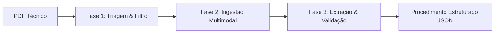

# Roteiro de Preparação para Entrevista: Cientista de Dados na Coamo

Este roteiro organiza sua experiência em **IA Generativa, RAG e Visão Computacional**, estruturando a sua fala para a vaga de **Cientista de Dados** na **Coamo** (Campo Mourão/PR). Ele está dividido em seções estratégicas para você revisar antes e usar durante a entrevista.

---

## 1. O "Pitch" Profissional (Apresentação de 2 minutos)

> [!TIP]
> O objetivo aqui é conectar seu trabalho na **Tractian** (indústria/manutenção) com sua pesquisa de mestrado na **UTFPR** (soja/AgTech) e mostrar como essa bagagem gera valor para a **Coamo** (cooperativa agroindustrial).

### Exemplo de fala estruturada:
> *"Olá, meu nome é Renan Akio Shibukawa. Sou Engenheiro de Machine Learning e mestrando em Inteligência Computacional pela UTFPR. Atualmente trabalho na Tractian desenvolvendo soluções de IA Generativa e RAG para manutenção industrial.
> 
> Minha experiência transita em duas grandes vertentes de IA: **Visão Computacional clássica e profunda**, onde no meu mestrado desenvolvo modelos de Edge AI para identificar danos foliares na cultura da soja (AgTech); e **IA Generativa / LLM Engineering**, onde na Tractian criei pipelines ponta a ponta para ingestão e estruturação de documentos complexos, lidando com extração multimodal (imagens/tabelas) e geração de procedimentos técnicos de alta precisão.
> 
> Vejo uma sinergia muito forte com a Coamo, pois posso aplicar o estado da arte de visão computacional diretamente no campo e na análise de grãos, e ao mesmo tempo usar GenAI para otimizar o acesso a regulamentos técnicos, manuais agrícolas e processos internos da cooperativa."*

---

## 2. Estruturação do seu Case Principal: Workflow de Geração de Procedimentos

Ao explicar o seu projeto da Tractian, use o **Método STAR** (Situação, Tarefa, Ação, Resultado) e divida o pipeline técnico nas 3 fases que você mencionou.

### O Contexto (Situação e Tarefa)
* **Desafio:** Manuais de máquinas industriais são PDFs gigantescos, não estruturados, cheios de tabelas, diagramas e ruídos. O objetivo era criar uma IA que processasse esses manuais e extraísse/gerasse procedimentos de manutenção claros e executáveis, garantindo que o formato de saída fosse confiável.

---

### Detalhamento Técnico das Etapas

### Fase 1: Classificação e Triagem Inteligente (Roteamento)
* **Como explicar:**
  > *"Antes de gastar processamento e tokens com arquivos inválidos, o primeiro passo do pipeline é a triagem. Desenvolvi um classificador/filtro que analisa os metadados e o conteúdo inicial do PDF para rotular o tipo do documento (se é um manual técnico, um relatório financeiro, uma folha de dados ou um arquivo escaneado vazio). Se o documento não for relevante, ele é descartado ou direcionado para um fluxo específico de OCR."*
* **Palavras-chave:** Classificação de Documentos, Roteamento de Queries, Otimização de Custo/Tokens.

### Fase 2: Ingestão Multimodal e Parsing Baseado em Páginas
* **Como explicar:**
  > *"Documentos técnicos não são apenas texto. Eles contêm diagramas de peças, esquemas elétricos e tabelas de torque. Para não perder esse contexto, o pipeline divide o documento página por página e faz uma análise multimodal. Nós geramos descrições textuais das imagens e das tabelas usando LLMs de visão e injetamos essas descrições como metadados associados à respectiva página. Isso enriquece os chunks para o RAG, permitindo que a busca encontre uma imagem baseado na sua descrição semântica."*
* **Palavras-chave:** Parsing de PDF, Ingestão Multimodal, Descrição de Imagens (Image Captioning), Recuperação de Tabelas.

### Fase 3: Extração Estruturada e Validação (Data Contracts)
* **Como explicar:**
  > *"Por fim, avaliamos se aquela página ou conjunto de páginas contém de fato um procedimento executável. Se contiver, extraímos os passos (ferramentas necessárias, EPIs, passo a passo) usando modelos de linguagem instruídos a retornar dados estritamente tipados. Utilizamos contratos de dados via Pydantic para validar se a resposta gerada pela LLM obedece rigorosamente ao esquema esperado (JSON). Se a resposta falhar na validação, o pipeline executa um mecanismo de retry automático ou fallback."*
* **Palavras-chave:** Extração Estruturada de Informação, Pydantic, Data Contracts, Validação de Outputs, Robustez de Sistemas de IA.

---

## 3. Conexão Estratégica com a Coamo (O Diferencial de Negócio)

> [!IMPORTANT]
> A Coamo é uma gigante do cooperativismo agroindustrial. Mostre como seus dois mundos (Mestrado AgTech + IA Industrial na Tractian) se aplicam perfeitamente ao negócio deles.

| Sua Experiência | Aplicação Prática na Coamo |
| :--- | :--- |
| **Mestrado em AgTech (Detecção de danos em Soja com Visão Computacional)** | * **Classificação de Grãos:** Automatizar a detecção de impurezas ou defeitos em soja/milho recebidos nos entrepostos. * **Monitoramento no Campo:** Análise de imagens de drone ou celular para identificar pragas precocemente nas lavouras dos cooperados. |
| **IA Generativa / Ingestão Multimodal** | * **Assistente do Agrônomo:** Um RAG robusto indexando todas as bulas de defensivos agrícolas, manuais de cultivo e relatórios de solo para dar suporte rápido aos agrônomos de campo. * **Processamento de Notas Fiscais/Contratos:** Automatização de leitura de documentos de frete, contratos de cooperados e notas fiscais de insumos. |
| **Trabalho na Tractian (Manutenção Industrial)** | * **Eficiência Operacional:** A Coamo possui dezenas de indústrias (esmagamento de soja, fiação, moinhos de trigo). Sua experiência em manutenção preditiva e IA industrial pode ser usada para otimizar o maquinário fabril da própria cooperativa. |

---

## 4. Possíveis Perguntas Técnicas e Como Responder

### Pergunta 1: *"Como você avalia a qualidade das respostas do RAG ou da extração?"*
* **Como responder:** Diga que avalia em duas frentes:
  1. **Integridade de Dados (Sintática):** Validação rígida com Pydantic garantindo que campos obrigatórios e formatos de dados nunca quebrem na API.
  2. **Qualidade Semântica (LLM-as-a-Judge):** Uso de frameworks ou abordagens de avaliação onde uma LLM avaliadora (como GPT-4o) valida os critérios de *Fidelidade ao Contexto* (se a IA inventou dados) e *Relevância da Resposta* (se respondeu à pergunta).

### Pergunta 2: *"PDFs escaneados ou com layouts complexos costumam quebrar os parsers. Como você resolve isso?"*
* **Como responder:**
  > *"Em layouts complexos com colunas, o `pypdf` clássico pode misturar as linhas. Por isso, no meu fluxo de estudos e testes utilizei tecnologias como o **Docling** (da IBM), que reconstrói a estrutura lógica em Markdown. Para PDFs que são puramente imagens escaneadas, aplicamos OCR híbrido e, quando necessário, processamos a página diretamente como imagem usando LLMs multimodais para extrair o texto de forma estruturada."*

### Pergunta 3: *"Por que usar busca híbrida e reranking com ColBERT (como no seu projeto do mestrado/RAG)?"*
* **Como responder:**
  > *"A busca Dense (`E5`) é excelente para conceitos sinônimos, mas falha em termos muito específicos (ex: nomes de pragas ou marcas de defensivos). O Sparse (`BM25`) garante a busca exata de palavras-chave. Juntamos ambos usando RRF. O ColBERT entra no final como um reranqueador leve de Late Interaction, recalculando a relevância token-a-token apenas no Top 15 resultados, garantindo altíssima precisão com baixa latência se comparado a um Cross-Encoder tradicional."*
