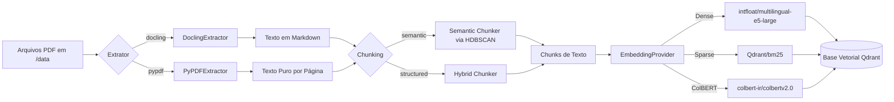
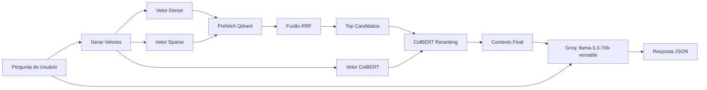

# Arquitetura e Fluxo do Módulo RAG

Este documento detalha o funcionamento e os dois passos principais do sistema de **Retrieval-Augmented Generation (RAG)** implementado para consultas em documentos técnicos sobre pragas e danos em folhas de soja.

---

## 🏗️ Passo 1: Pipeline de Ingestão (Offline / Preparação)

O objetivo desse passo é ler PDFs técnicos, quebrá-los em pedaços coerentes (chunks), extrair características semânticas e armazená-los no banco vetorial **Qdrant**.



### 1. Extração de Texto
Configurado no orquestrador [core.py](../../src/rag/ingestion/core.py), o sistema possui dois extratores:
* **DoclingExtractor** ([docling_extractor.py](../../src/rag/ingestion/extractors/docling_extractor.py)): Utiliza a biblioteca `docling` da IBM para ler e converter PDFs mantendo a formatação estrutural e exportando para Markdown.
* **PyPDFExtractor** ([pypdf_extractor.py](../../src/rag/ingestion/extractors/pypdf_extractor.py)): Extrator padrão usando `pypdf`, que processa o PDF página por página.

### 2. Chunking Semântico vs Estruturado
O tamanho máximo de cada bloco é delimitado por `MAX_TOKENS = 500` ([constants.py](../../src/rag/shared/constants.py)).
* **Semantic Chunker** ([chunker.py](../../src/rag/ingestion/utils/chunker.py)):
  1. Quebra o texto por parágrafos (`\n\n`).
  2. Gera embeddings de Sentence Transformers (`intfloat/multilingual-e5-large`).
  3. Utiliza o algoritmo de clusterização **HDBSCAN** para agrupar semanticamente parágrafos correlatos.
  4. Agrupa os parágrafos em blocos de até 500 tokens. Parágrafos sem cluster (órfãos) são re-clusterizados ou integrados individualmente.
* **Structured Chunker**:
  * Utiliza o `HybridChunker` nativo do Docling, mantendo hierarquia e estrutura do documento (títulos, listas, seções).

### 3. Geração de Embeddings Híbridos (Dense + Sparse + ColBERT)
No arquivo [providers.py](../../src/rag/ingestion/providers.py), cada chunk é transformado em três representações vetoriais usando a biblioteca `fastembed` para otimização de performance:
1. **Dense (E5)**: `intfloat/multilingual-e5-large` (Dimensão: 1024). Focado em similaridade semântica profunda.
2. **Sparse (BM25)**: `Qdrant/bm25`. Focado em busca de palavras-chave exatas (termos agronômicos específicos).
3. **ColBERT**: `colbert-ir/colbertv2.0` (Late Interaction). Focado na relação detalhada entre os tokens do texto.

### 4. Indexação no Qdrant
Os três tipos de vetores são inseridos no Qdrant sob uma única coleção `agronomia-soja`.
* O esquema vetorial da coleção está configurado no método `create_collection` em [providers.py](../../src/rag/ingestion/providers.py).

---

## 🔍 Passo 2: Recuperação e Geração (Online / API / RAG)

O pipeline de consulta consome os vetores salvos e gera a resposta detalhada através do LLM.



### 1. Busca Híbrida em Múltiplos Estágios
No serviço de busca ([services/search.py](../../src/api/services/search.py)), o processo ocorre da staggering forma:
1. **Geração de Embeddings da Pergunta**: A pergunta do usuário passa pelo `EmbeddingService` para gerar as três representações (Dense, Sparse e ColBERT).
2. **Prefetch Híbrido**: É realizada uma consulta em paralelo no Qdrant buscando:
   * Top 10 resultados via busca Dense.
   * Top 10 resultados via busca Sparse (BM25).
3. **Fusão via RRF (Reciprocal Rank Fusion)**: Os resultados de Dense e Sparse são unificados usando o algoritmo RRF do Qdrant para criar uma lista consolidada dos 15 candidatos mais relevantes.
4. **Late Interaction Reranking**: Os 15 candidatos finais sofrem um reranking no Qdrant usando a busca do **ColBERT**. Isso calcula a similaridade token-a-token entre a pergunta e os chunks selecionados, retornando o Top `N` (geralmente 3) resultados mais alinhados.

### 2. Geração da Resposta com Pydantic AI
No serviço de RAG ([services/rag.py](../../src/api/services/rag.py)):
1. O contexto com as fontes e páginas encontradas (Ex: `[Fonte: documento.pdf, Pág: X]`) é concatenado com a pergunta original.
2. Um agente `pydantic-ai` (`Agent`) configurado com o modelo `llama-3.3-70b-versatile` no Groq recebe o prompt do sistema ([prompts.py](../../src/api/config/prompts.py)).
3. O LLM extrai e gera a resposta garantindo formatação JSON estrita estruturada via o schema `RAGOutput` ([models/rag.py](../../src/api/models/rag.py)), que retorna:
   * Nome da praga (`pest_name`) e nome científico (`scientific_name`).
   * Resumo da resposta (`summary`).
   * Principais danos listados (`key_damages`).
   * Recomendações de manejo (`management_recommendations`).
   * Rastreabilidade das fontes (`sources`).

---

## 🚦 Como Rodar e Testar

### 1. Script de Ingestão de Dados (Offline)
Para indexar os PDFs presentes na pasta `src/rag/data`:
```bash
python -m rag.ingestion.main --extractor docling --chunker semantic
```
*(Adicione `-r` ou `--recreate` se quiser recriar a coleção do zero).*

### 2. Script de Teste Rápido (Query)
Para rodar uma consulta de exemplo sem a API web e verificar se a conexão com o Qdrant e o Groq está correta:
```bash
python -m rag.ingestion.test_query
```

### 3. API do RAG (Produção)
A API expõe o endpoint `/api/rag` para receber perguntas do usuário e devolver a resposta estruturada.
* Roteador: [routers/rag.py](../../src/api/routers/rag.py)
* Serviço: [services/rag.py](../../src/api/services/rag.py)
