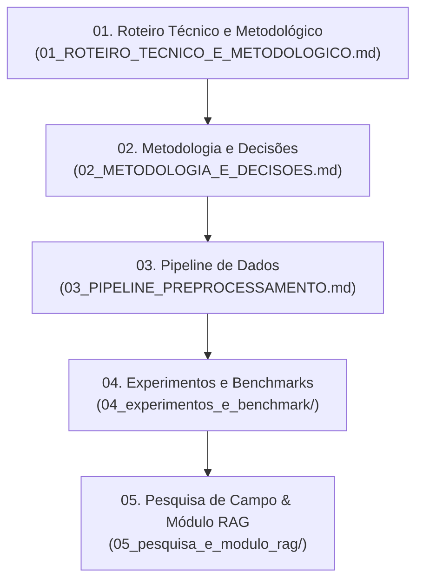

# 📚 Documentação Técnica e Científica do Projeto
## Classificação de Pragas da Soja em Borda

Este diretório reúne todos os relatórios, decisões de arquitetura, guias operacionais de dados e análises experimentais do projeto de pesquisa científica.

---

## 🗺️ Guia de Leitura Cronológica Recomendada

Para compreender a evolução e a fundamentação do projeto do início ao fim, recomenda-se a seguinte ordem de leitura:

---

### Fase 1: Visão Geral e Rigor Metodológico
1. [**`01_ROTEIRO_TECNICO_E_METODOLOGICO.md`**](01_ROTEIRO_TECNICO_E_METODOLOGICO.md):  
   *A fonte única da verdade.* Consolida as 10 classes de pragas, o particionamento 90/10 sem vazamento por imagem-mãe, as resoluções de entrada ($240\times240$ no B1), confirmação de desativação de CBAM/SRCNN e ativação de TopK Pooling, exportação TFLite FP16 e a tabela de resultados finais.
2. [**`02_METODOLOGIA_E_DECISOES.md`**](02_METODOLOGIA_E_DECISOES.md):  
   *Controle experimental rigoroso (Ceteris Paribus).* Justifica a otimização bayesiana independente (Keras Tuner) para baseline vs. proposta e detalha a matriz de modelos.

---

### Fase 2: Engenharia e Preparação de Dados
3. [**`03_PIPELINE_PREPROCESSAMENTO.md`**](03_PIPELINE_PREPROCESSAMENTO.md):  
   Fluxo ponta a ponta: extração de dados brutos, margem foliar de +20%, detector YOLOv8 para auto-crop no iNaturalist (licenças Creative Commons) e divisão por grupo.

---

### Fase 3: Experimentos, Perda e Benchmarks ([`04_experimentos_e_benchmark/`](04_experimentos_e_benchmark/))
4. [**`04_experimentos_e_benchmark/01_analise_focal_loss_soja.md`**](04_experimentos_e_benchmark/01_analise_focal_loss_soja.md):  
   Dedução matemática da *Categorical Focal Loss* ($\gamma = 1.5$) demonstrando por que a Cross-Entropy com pesos simples destruía a precisão das classes raras.
5. [**`04_experimentos_e_benchmark/02_benchmark_ip102_e_downstream.md`**](04_experimentos_e_benchmark/02_benchmark_ip102_e_downstream.md):  
   Avaliação comparativa das 5 arquiteturas leves de borda no pré-treinamento IP102 (102 classes) e transferência downstream para o dataset da soja e teste zero-shot INSECT12C.
6. [**`04_experimentos_e_benchmark/03_estudo_ablacao_ip102_vs_imagenet.md`**](04_experimentos_e_benchmark/03_estudo_ablacao_ip102_vs_imagenet.md):  
   Estudo oficial de ablação na EfficientNetV2-B1 comparando ImageNet vs. IP102, comprovando ganhos consolidados na soja (+4,3% Acc / +6,3% F1) e no teste independente INSECT12C (+7,2% F1).
7. [**`04_experimentos_e_benchmark/04_analise_qualitativa_ruido_mineracao_e_polimorfismo.md`**](04_experimentos_e_benchmark/04_analise_qualitativa_ruido_mineracao_e_polimorfismo.md):  
   Diagnóstico qualitativo de ruído amostral (mariposas adultas e artefatos de detecção YOLO) na classe *Spodoptera albula* e seu impacto no gap de generalização com o teste zero-shot (*INSECT12C*).

---

### Fase 4: Pesquisa de Campo & Módulo RAG (Projeto Pessoal) ([`05_pesquisa_e_modulo_rag/`](05_pesquisa_e_modulo_rag/))
8. [**`05_pesquisa_e_modulo_rag/01_pesquisa_solucoes_mercado.md`**](05_pesquisa_e_modulo_rag/01_pesquisa_solucoes_mercado.md):  
   Levantamento de aplicações e ferramentas concorrentes existentes para identificação de pragas no agronegócio.
9. [**`05_pesquisa_e_modulo_rag/02_roteiro_entrevista_campo.md`**](05_pesquisa_e_modulo_rag/02_roteiro_entrevista_campo.md):  
   Roteiro de entrevistas com agrônomos, produtores e cooperativas para validação de usabilidade da solução em campo.
10. [**`05_pesquisa_e_modulo_rag/03_arquitetura_sistema_rag.md`**](05_pesquisa_e_modulo_rag/03_arquitetura_sistema_rag.md):  
    Documentação técnica da prova de conceito da API de RAG: *Docling*, *Semantic Chunking* (HDBSCAN), representação híbrida (*Dense E5* + *Sparse BM25* + *ColBERT*), banco vetorial *Qdrant* e LLM *Llama 3.3*.
